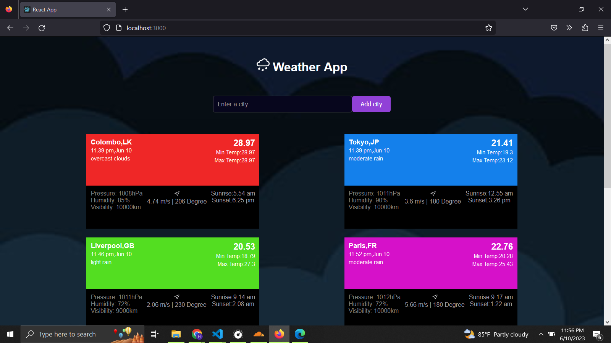
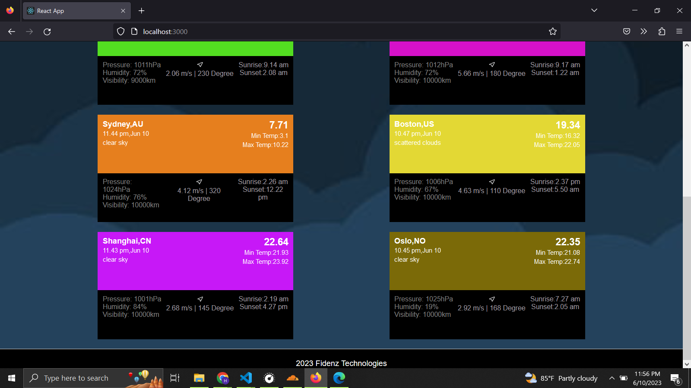
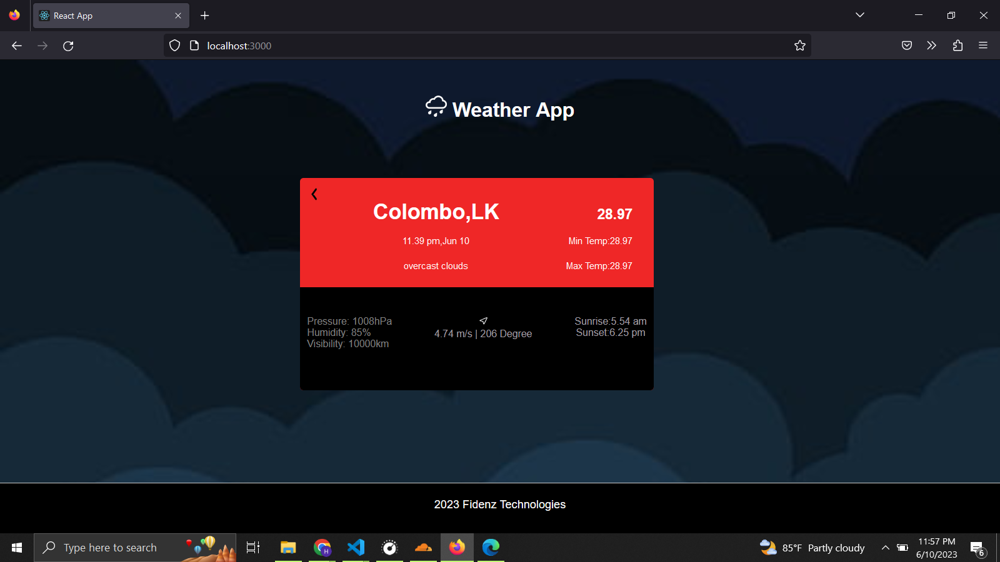

# Weather App

A simple weather application that provides current weather information for certain locations. Reads city IDs from a json file and uses it to gain weather information from an API. It displays information of the weather of the city including temperature, weather description, pressure, humidity, visibility, wind speed, wind direction, sunrise, and sunset.

## Features

-latest weather information from API

-Ability to click on a weather card to view detailed information

-Back button to return to the main screen

## Technologies Used

-React: JavaScript library for building user interfaces

-ReactDOM: Library for rendering React components

-CSS: Styling the weather cards and app layout

-Axios: HTTP client for making API requests

## APIs Used
-OpenWeatherMap: Retrieves weather data based on the user's input

## Preview of the application
<table>
   <tr>
    <td> </td>
   </tr> 
   <tr>
    <td> </td>
   </tr> 
   <tr>
      <td></td>
  </tr>
<table> 
